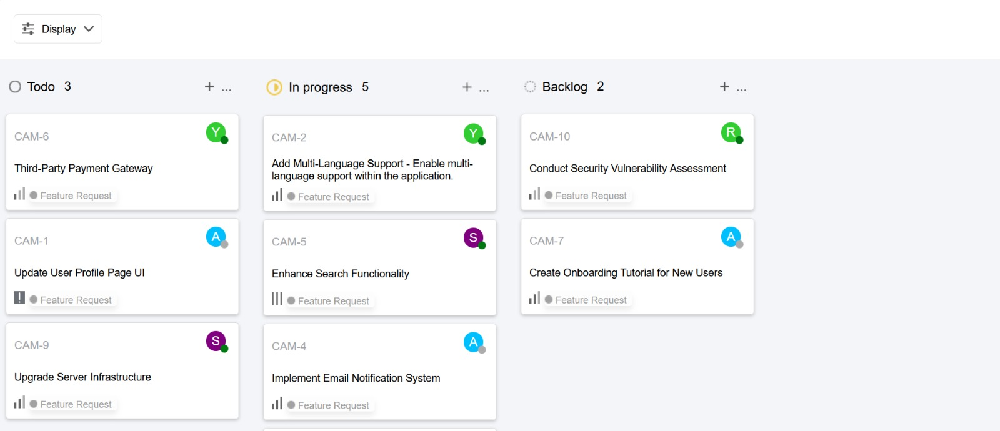
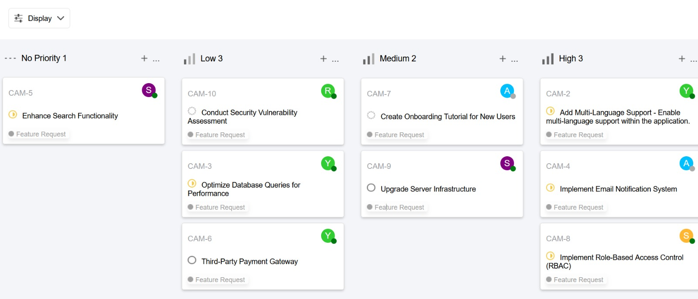
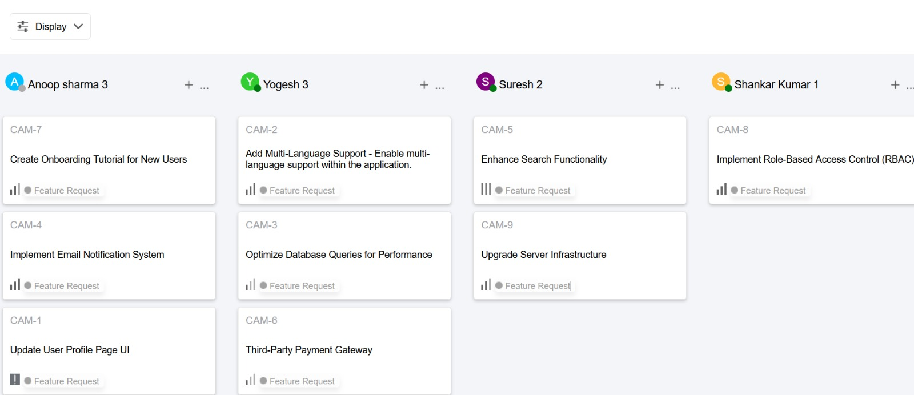

# Quicksell-Frontend-Assignment (Kanban Board Application)

This repository hosts a **Kanban Board Application** built with **React JS**, designed to work seamlessly with the API available at [https://api.quicksell.co/v1/internal/frontend-assignment](https://api.quicksell.co/v1/internal/frontend-assignment). It enables users to efficiently manage and organize tickets in a visually intuitive Kanban board layout, offering multiple grouping and sorting options.

## Features

### Grouping Options

The application provides three ways to categorize tickets on the Kanban board:

1. **By Status**: Organizes tickets based on their current status.
2. **By User**: Displays tickets assigned to specific users.
3. **By Priority**: Groups tickets according to their priority levels.

### Sorting Options

Tickets can be sorted using the following criteria:

1. **Priority**: Displays tickets in descending order of their priority.
2. **Title**: Arranges tickets alphabetically by their titles in ascending order.

### Priority Levels

Each ticket is assigned one of the following priority levels:

- **Urgent**: Level 4
- **High**: Level 3
- **Medium**: Level 2
- **Low**: Level 1
- **No Priority**: Level 0

### Additional Features

- **Persistent Preferences**: User preferences and view settings are preserved even after refreshing the page.
- **User-Friendly Interface**: A sleek design inspired by provided visuals ensures ease of use.

---

## Previews

### Group by Status, Order by Priority

### Group by Priority, Order by Priority

### Group by Priority, Order by Title

---

## API Integration

The application fetches ticket data from the following API endpoint:

- **API Endpoint**: [https://api.quicksell.co/v1/internal/frontend-assignment](https://api.quicksell.co/v1/internal/frontend-assignment)

> Ensure the API is accessible for the application to function correctly.

---

## Getting Started

### Prerequisites

To run the application locally, ensure you have the following installed:

- Node.js (v14 or higher)
- npm (v6 or higher)

